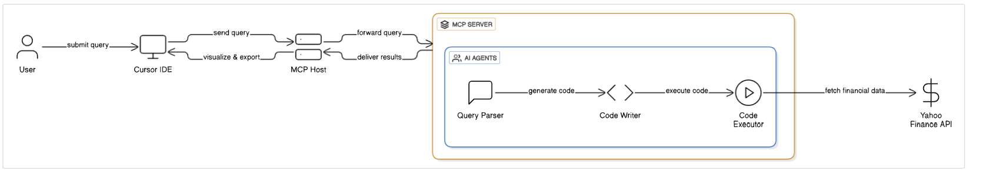

# MCP-Powered Financial Analyst

## Architecture

A sophisticated financial analysis system built using the Model Context Protocol (MCP) that leverages multiple AI agents to provide comprehensive financial insights and data visualization.

## Overview

This project implements a distributed financial analyst system that uses MCP architecture to coordinate between multiple specialized agents:

- **Agent 1 (Query Parser)**: Processes and interprets financial queries
- **Agent 2 (Code Writer)**: Generates analysis code based on parsed queries  
- **Agent 3 (Code Executor)**: Executes financial analysis scripts and computations

The system integrates with external financial data sources and provides interactive plotting capabilities for stock analysis, including year-to-date (YTD) performance tracking.

## Architecture

The system follows a client-server architecture:
- **MCP Host**: Handles query processing and response coordination
- **MCP Server**: Manages tool calls and agent orchestration
- **Tech Stack**: Built with Cursor IDE integration and DeepSeek AI capabilities

## Features

- Real-time financial data analysis
- Interactive stock performance visualization
- Multi-agent query processing pipeline
- YTD stock gain calculations and plotting
- Extensible agent-based architecture

## Prerequisites

- Python 3.8+
- UV package manager
- MCP dependencies

